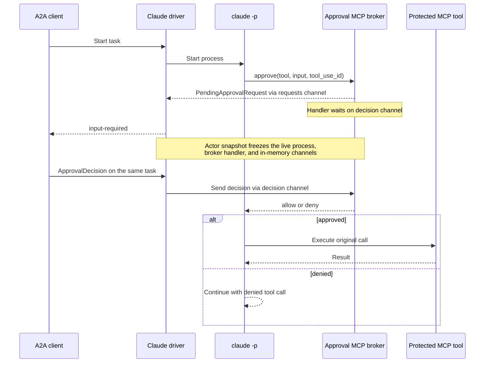

# Claude Harness

The Claude Harness runs Claude Code as a native Kagent runtime. It compiles an
`AgentTemplate` into Claude Code configuration, runs each turn in a Substrate
Actor, and exposes the result through Kagent's A2A API.

## Code structure

The controller and Actor share only the versioned config contract. Kubernetes
resolution stays in the controller; native process behavior stays in this
harness.

| Path | Look here for |
| --- | --- |
| [`../../core/internal/translator/claude`](../../core/internal/translator/claude) | Translating `Harness`, `AgentTemplate`, model, MCP, plugin, and Secret inputs into a runtime revision and warnings |
| [`config/config.go`](config/config.go) | The versioned JSON contract shared by the compiler and runtime, including defaults and reserved environment variables |
| [`cmd/main.go`](cmd/main.go) | Actor startup, environment inputs, Claude version validation, continuation-store wiring, and private A2A startup |
| [`internal/adapter/adapter.go`](internal/adapter/adapter.go) | Materializing Claude home, skills, MCP config, and ephemeral provider credentials |
| [`internal/driver`](internal/driver) | Claude CLI arguments, stream-JSON parsing, runtime-event translation, cancellation, and process supervision |

## Working

- [x] Anthropic API keys and Amazon Bedrock bearer tokens, injected by the gateway
- [x] Streaming text, tool calls, and tool results over A2A
- [x] Task cancellation
- [x] Durable Claude session resume between turns
- [x] Claude Code built-in tools
- [x] Shared local subagents
- [x] Standalone skills and plugin-provided skills
- [x] Direct HTTP and SSE MCP servers with whole-server tool access
- [x] Human-in-the-loop MCP tool approval

Credentials use [Substrate gateway injection](../../../docs/architecture/credential-injection.md).
AWS IAM keys and Vertex service-account keys require local signing and are rejected
by the compiler. Harness environment entries accept only literal values.

## Turn completion and background work

Each runtime turn starts one `claude -p` process with stream-JSON input and
output, verbose output, and partial messages. The driver sends one user message
and closes stdin. Later turns start another process with `--resume` and the
exact durable conversation ID. A human approval parks the current live process
and resumes it after the decision.

Headless configuration defaults to `allow_background_tasks: false` and
`allow_scheduled_tasks: false`. The adapter sets
`CLAUDE_CODE_DISABLE_BACKGROUND_TASKS=1` and `CLAUDE_CODE_DISABLE_CRON=1`,
overriding inherited environment values. The default `disallowed_tools` list
contains `ScheduleWakeup`, `Monitor`, `CronCreate`, `CronList`, `CronDelete`,
and `RemoteTrigger`, passed through `--disallowedTools` to remove those tools.
These are versioned harness JSON settings; the compiler emits the safe defaults.
Standalone configurations can opt in and replace the deny list (an explicit
empty list clears it). Enabling background or scheduled work also requires
removing the corresponding tools from that list. No public CRD fields are added.
See Claude's [environment variables](https://code.claude.com/docs/en/env-vars),
[tool reference](https://code.claude.com/docs/en/tools-reference), and
[CLI reference](https://code.claude.com/docs/en/cli-reference).

Claude can continue after an iteration's `result` when background work finishes.
The driver consumes that activity and any further approvals until stdout ends
and the process exits, then returns the last result once. Results whose origin
is `task-notification` also describe a root follow-up iteration and participate
in that outcome. The existing turn context bounds both stream consumption and
the exit wait; cancellation interrupts, kills, and reaps the process group.
Malformed streams and unexpected process exits still fail the turn.
See [Claude's headless exit behavior](https://code.claude.com/docs/en/headless#background-tasks-at-exit).

## Telemetry

The driver passes each prompt to Claude Code on stdin as stream-JSON. When
Claude Code telemetry is on, it holds the prompt until that telemetry has
initialized. Claude Code starts a turn without waiting for its telemetry, and
with first-party Anthropic credentials that initialization first waits on a
managed settings fetch. A turn that starts earlier drops its spans, events and
metrics, and ignores `TRACEPARENT`. The driver therefore adds a loopback
Prometheus metrics reader and sends the prompt once `claude_code.session.count`
appears there, which Claude Code increments only after its providers are
registered. That ordering is a Claude Code implementation detail, verified on
2.1.260 and 2.1.282.

The wait is bounded at 10 seconds, so a stalled settings fetch delays a turn by
at most that much. The driver then sends the prompt and records a
`kagent.claude.telemetry_not_ready` event on the turn's `invoke_agent` span, as
it also does when it cannot reserve the loopback port. Claude Code stops waiting
for the fetch after 30 seconds, so in a turn that runs past then, spans started
after its telemetry initializes become roots of new traces rather than being
absent.

## Human-in-the-loop approval flow

Claude runs in print mode with `permissions.ask` rules for MCP servers
that require approval. Its native `--permission-prompt-tool` calls a private,
authenticated loopback MCP tool before executing a protected call.

The adapter sets `timeout: 100000000` milliseconds (about 27 hours 47 minutes)
on the reserved `kagent_hitl` server only. In the pinned Claude Code 2.1.260,
this bounds the permission call and raises its idle and HTTP request limits
to cover human approval waits, including wall time while the Actor is suspended.
Ordinary MCP servers retain their configured timeouts or native defaults.
Explicit timeouts must be integers from 1,000 to 2,147,483,647 milliseconds;
smaller values fall back to native defaults, and larger values can overflow
JavaScript timers, so the configuration rejects both.
See [Claude Code MCP timeouts](https://code.claude.com/docs/en/mcp) and
[JavaScript timer bounds](https://nodejs.org/api/timers.html#settimeoutcallback-delay-args).

This is a finite wait bound, not indefinite approval durability. A permission
call that waits beyond it still fails; accepting a later decision does not prove
that the protected tool executed. A new call, even with identical arguments,
requires its own approval. The timeout applies to newly configured processes;
it does not repair a parked process whose permission call already expired.



The `requests` channel carries a new pending request from the MCP handler to the
process driver. The per-request `decision chan runtime.ApprovalDecision` carries
the response in the other direction. The channel is not durable storage: the
full Actor memory snapshot preserves the live Claude process, blocked handler,
and channel together until the same task resumes. If we want to switch to DATA
snapshot in the future, we will need to switch to using deferred tool call with
hooks instead.

See [defer a tool call for later](https://code.claude.com/docs/en/hooks#defer-a-tool-call-for-later).

The `permission-prompt-tool` might not work if you modify the permission rules,
permission mode, hooks (like `PreToolUse / PermissionRequest`) since they resolve
the tool calls first before Claude's permission system invoke the `permission-prompt-tool`.
If this tool does not respond (e.g. error or timeout or failed connection),
the unresolved requests are denied, not approved.

## Planned / not yet supported

- [ ] Ask User tool (removed upstream, see https://github.com/anthropics/claude-code/issues/77994, would require Agents SDK)
- [ ] Checkpoint and fork continuity for Claude sessions
- [ ] Enforced selection of individual tools from an MCP server
- [ ] Dedicated subagents running in separate Sessions
- [ ] Skills, MCP tools, and nested subagents on local subagents
- [ ] Configuring Claude Code permission mode and trust boundary in Harness CRD

## Example usage

One `Agent` holds both the template and Harness inline. The referenced ModelConfig
and RemoteMCPServer must already exist in `kagent`. Replace `${KAGENT_CLAUDE_IMAGE}`
with the full harness image reference, including its `@sha256:` digest.

```yaml
apiVersion: api.kagent.dev/v1alpha3
kind: Agent
metadata:
  name: kagent-claude
  namespace: kagent
spec:
  template:
    description: test
    modelConfig:
      name: bedrock-claude # Assuming you have created a modelconfig using Bedrock Anthropic
    systemPrompt: |
        Follow the selected skill and use the configured MCP tool.
    tools:
      - mcp:
          server:
            kind: RemoteMCPServer
            name: kagent-tool-server
    plugins:
      - source:
          git:
            url: https://github.com/agentplugins/agent-plugins-example.git
            commit: 5f3f5084a821aefa792e79500dd8f0462ab83473
        skills:
          - migrate-agent-plugin
  harness:
    claude: {}
    workload:
      image: ${KAGENT_CLAUDE_IMAGE}
    substrate:
      workerPoolRef:
        name: kagent-default
      snapshotPolicy:
        location: gs://ate-snapshots/kagent/
```
